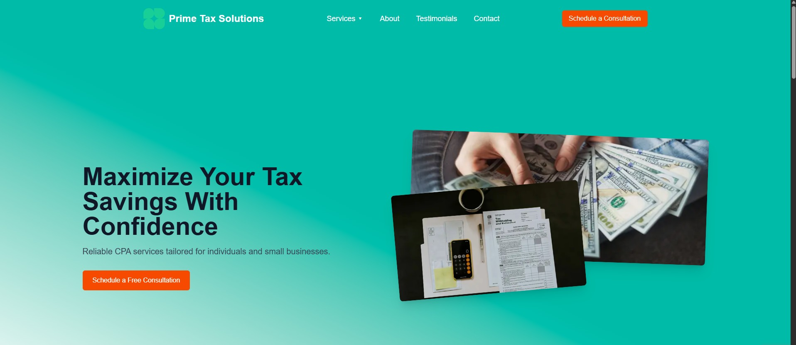
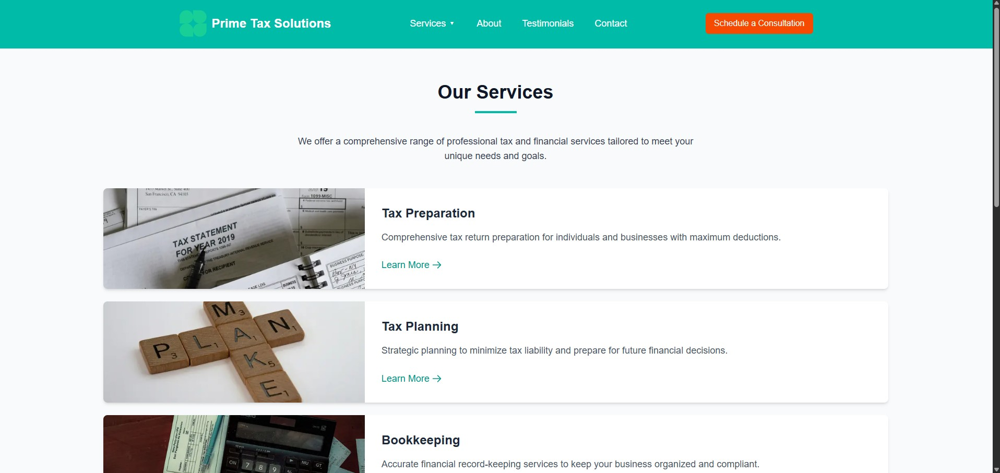
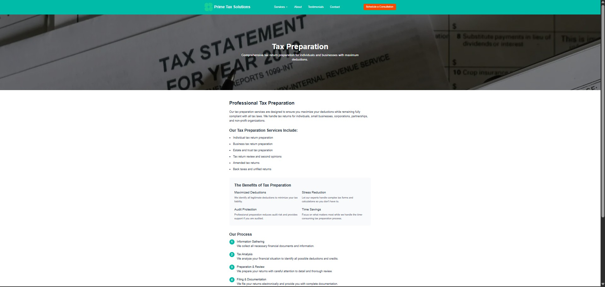
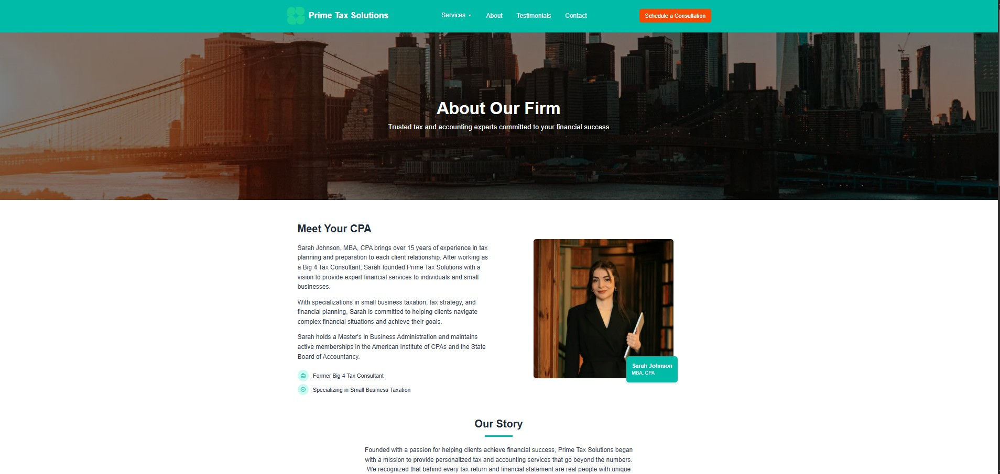
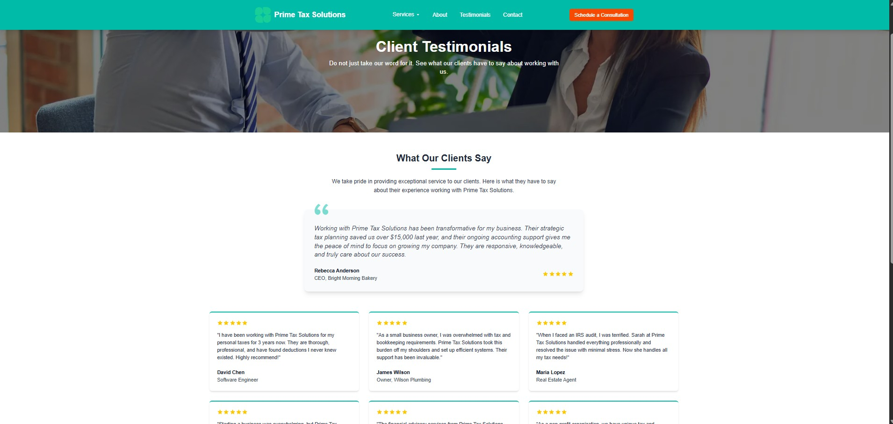
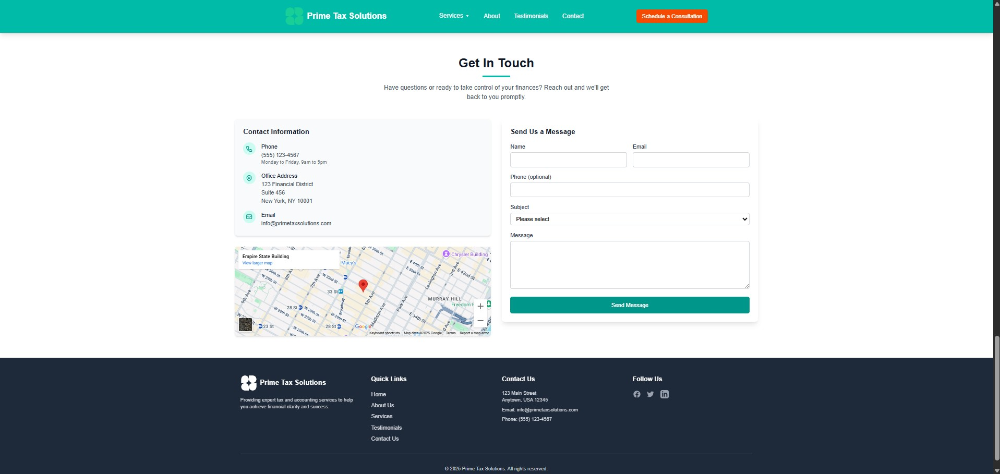
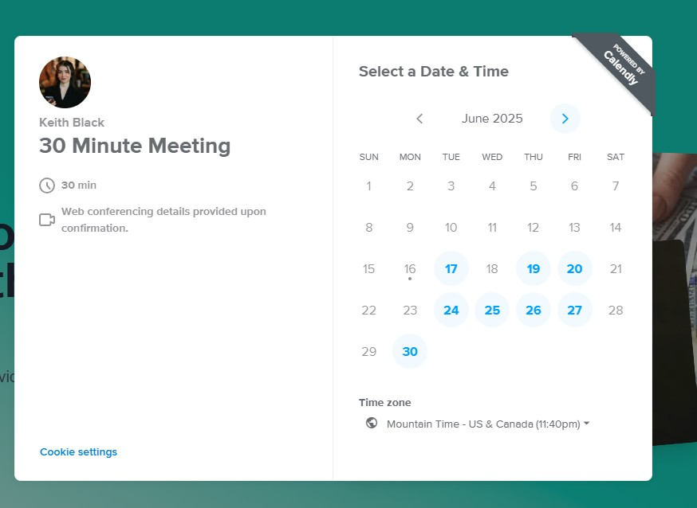

# Prime Tax Solutions - CPA Website Template

This project is a modern, responsive website template built for Certified Public Accountants (CPAs), tax professionals, and accounting firms. It aims to provide a professional online presence, making it easy for potential clients to learn about services, read testimonials, and schedule consultations.

The template is designed with a clean and user-friendly interface, focusing on clear communication of services and expertise.

## Live Demo

[Live demo](https://cpa-template-tau.vercel.app/)

## Key Features

*   **Responsive Design:** Adapts to all screen sizes (desktops, tablets, and mobile phones).
*   **Service Pages:** Dedicated sections and individual pages to detail the services offered (e.g., Tax Preparation, IRS Representation, Bookkeeping).
*   **About Us Page:** Introduce the firm, its mission, values, and key personnel.
*   **Testimonials Section:** Showcase client feedback to build trust and credibility.
*   **Integrated Contact Form:** Allows visitors to send inquiries directly.
*   **Consultation Scheduling:** Seamless integration with Calendly for booking appointments via a modal.
*   **SEO-Friendly Structure:** Built with Next.js for good search engine performance.
*   **Easy Customization:** Designed to be easily adaptable with your firm's branding, content, and specific services.

## Technologies Used

This project is built with a modern web development stack:

*   **Framework:** [Next.js](https://nextjs.org/) (v14+ with App Router) - A React framework for building full-stack web applications.
*   **Language:** [TypeScript](https://www.typescriptlang.org/) - For static typing and improved developer experience.
*   **Styling:** [Tailwind CSS](https://tailwindcss.com/) - A utility-first CSS framework for rapid UI development.
*   **UI Components:** Built with [React](https://react.dev/).
*   **Scheduling Integration:** [Calendly](https://calendly.com/) - Embedded via `react-calendly` for consultation bookings.
*   **Deployment:** Optimized for [Vercel](https://vercel.com/) (though deployable elsewhere).
*   **Font Optimization:** Utilizes `next/font` (e.g., with Geist or Inter).

## Website Pages & Screenshots

Below are some of the key pages included in the template.

*(Replace the `placeholder-*.jpg` paths with actual paths to your screenshots after you take them. You can store them in an `images` or `screenshots` folder in your project root or an `assets` folder, and then link to them relatively.)*

---

### 1. Homepage

*Description: The main landing page featuring a hero section, overview of services, call-to-actions, and sections leading to other parts of the site.*



---

### 2. Services Overview Page

*Description: A page listing all the primary services offered by the firm, with links to individual service detail pages.*



---

### 3. Individual Service Page (Example)

*Description: A detailed page for a specific service, outlining benefits, processes, and a call-to-action.*



---

### 4. About Us Page

*Description: Information about the firm's history, mission, values, and team members.*



---

### 5. Testimonials Page

*Description: A collection of client testimonials to build trust and showcase client satisfaction.*



---

### 6. Contact Section (on Homepage) & Consultation Modal

*Description: The "Get in Touch" contact form section on the homepage, and an example of the Calendly consultation scheduling modal.*




---

## Getting Started

To get a local copy up and running, follow these simple steps.

### Prerequisites

*   Node.js (v18.x or later recommended)
*   npm, yarn, pnpm, or bun

### Installation

1.  Clone the repo:
    ```bash
    git clone https://your-repository-url.git
    cd cpa-template
    ```
2.  Install NPM packages:
    ```bash
    npm install
    # or
    yarn install
    # or
    pnpm install
    ```
3.  Set up environment variables:
    *   Create a `.env.local` file in the root of your project.
    *   Add your Calendly event URL:
        ```env
        NEXT_PUBLIC_CALENDLY_URL=https://calendly.com/YOUR_USERNAME/YOUR_EVENT
        ```
    *   Replace `https://calendly.com/YOUR_USERNAME/YOUR_EVENT` with your actual Calendly link.

### Running the Development Server

Execute one of the following commands:

```bash
npm run dev
# or
yarn dev
# or
pnpm dev
# or
bun dev
```

Open [http://localhost:3000](http://localhost:3000) with your browser to see the result.
The page auto-updates as you edit files in the `src` directory.

## Customization Guide

*   **Branding & Logo:**
    *   Replace logo files (e.g., `public/logoipsum-225.svg`) with your own.
    *   Update color schemes in Tailwind CSS configuration (`tailwind.config.ts`) or directly in components if needed (e.g., `bg-teal-600` can be changed to your brand color).
*   **Content:**
    *   Edit text content directly in the `.tsx` files within `src/app/` for pages and `src/components/` for shared components.
    *   Service details are primarily managed in `src/components/services/servicesData.ts` and rendered by `src/components/services/ServicePage.tsx`.
*   **Navigation:** Modify links in `src/components/navBar/navBar.tsx` and `src/components/footer/Footer.tsx`.
*   **Images:** Replace placeholder images in the `public/images/` directory and update paths in components.
*   **Calendly:** Ensure your `NEXT_PUBLIC_CALENDLY_URL` in `.env.local` points to your desired Calendly event.

## Learn More (Next.js)

To learn more about Next.js, take a look at the following resources:

- [Next.js Documentation](https://nextjs.org/docs) - learn about Next.js features and API.
- [Learn Next.js](https://nextjs.org/learn) - an interactive Next.js tutorial.

You can check out [the Next.js GitHub repository](https://github.com/vercel/next.js) - your feedback and contributions are welcome!

## Deploy on Vercel

The easiest way to deploy your Next.js app is to use the [Vercel Platform](https://vercel.com/new?utm_medium=default-template&filter=next.js&utm_source=create-next-app&utm_campaign=create-next-app-readme) from the creators of Next.js.

1.  Push your code to a Git repository (GitHub, GitLab, Bitbucket).
2.  Import your project into Vercel.
3.  Configure Environment Variables: Add `NEXT_PUBLIC_CALENDLY_URL` in your Vercel project settings.
4.  Deploy!

Check out the [Next.js deployment documentation](https://nextjs.org/docs/app/building-your-application/deploying) for more details.

## Contributing

Contributions are what make the open-source community such an amazing place to learn, inspire, and create. Any contributions you make are **greatly appreciated**.

If you have a suggestion that would make this better, please fork the repo and create a pull request. You can also simply open an issue with the tag "enhancement".
Don't forget to give the project a star! Thanks again!

1.  Fork the Project
2.  Create your Feature Branch (`git checkout -b feature/AmazingFeature`)
3.  Commit your Changes (`git commit -m 'Add some AmazingFeature'`)
4.  Push to the Branch (`git push origin feature/AmazingFeature`)
5.  Open a Pull Request

## License

Distributed under the MIT License. See `LICENSE` file for more information.